
<h1 align="center">基于BS的库存管理软件设计与实现+vue</h1>

## 简介
库存管理软件：提供入库管理、出库管理、公告信息管理、客户管理及物品信息管理功能，适用管理员和员工用户，支持快速身份验证和操作简便的界面设计。    --计算机毕业设计源码；毕设源码；java毕业设计源码

## 联系方式

<h3 align="center">获取完整代码与数据库文件 + 微信：deepguan QQ: 86050149 QQ群: 783742310</h3>

<h3 align="center">可帮忙远程部署 包运行成功！提供远程部署、修改代码、设计文档指导、代码讲解等服务！</h3>

## 功能介绍（完整见运行截图）
管理员：具备库存管理系统的公告信息管理、出入库管理和物品信息管理的权限。管理员可以通过导航菜单访问首页、个人中心和客户管理等功能模块。公告信息管理模块允许管理员添加、修改、删除公告，并查看公告的详细信息。出入库管理功能中的表格展示出入库编号、客户名称以及相关金额，提供新增、审核、导出数据等操作。物品信息管理中，管理员可以查看和编辑物品的编号、名称、类型、价格和库存量。

员工：负责日常的出入库管理以及查看和管理库存信息。员工可以通过登录界面进入系统，进行角色选择。出入库管理模块允许员工对出入库订单进行管理，包括输入订单号、调整商品数量、选择客户以及提交或取消交易等。库存管理界面提供商品名称、价格、数量的详细信息，员工可以通过搜索功能快速查找物品，进行物品新增、删除或库存调整等操作，确保库存数据的准确性和完整性。

## 运行截图
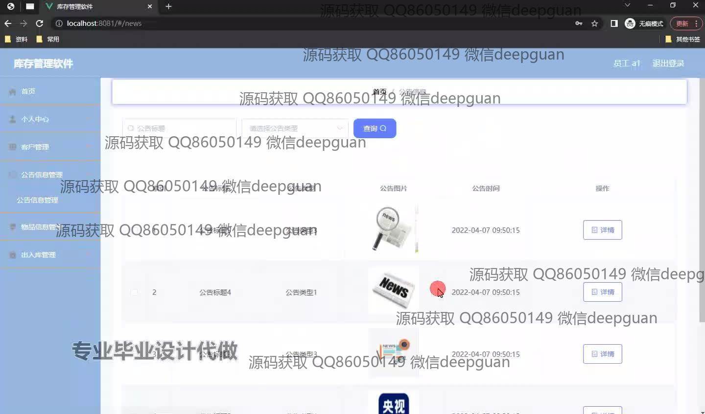
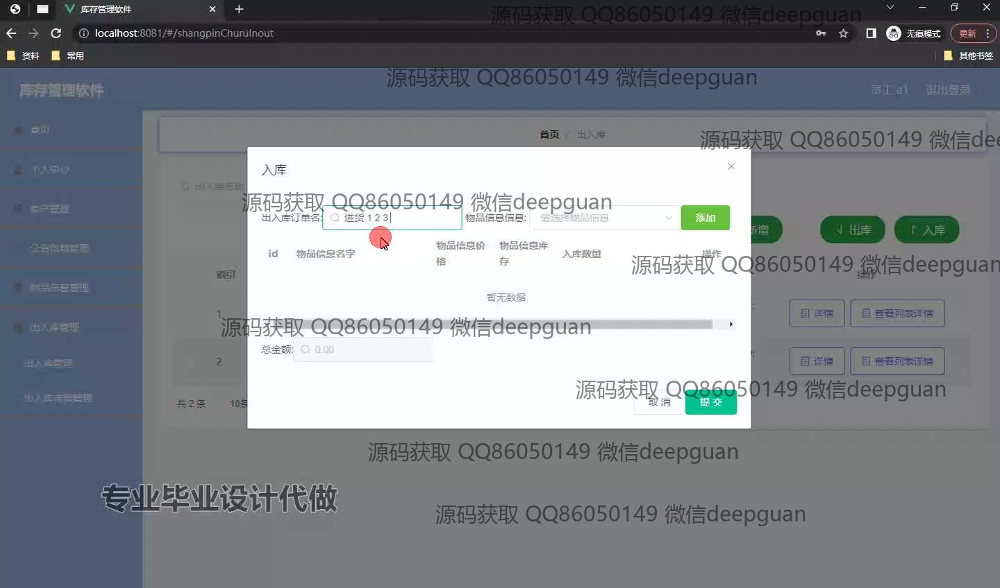
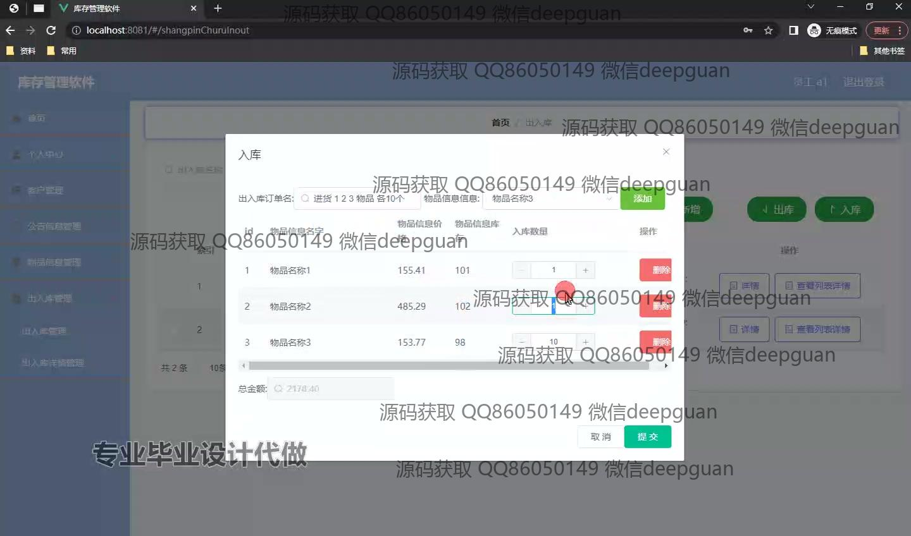
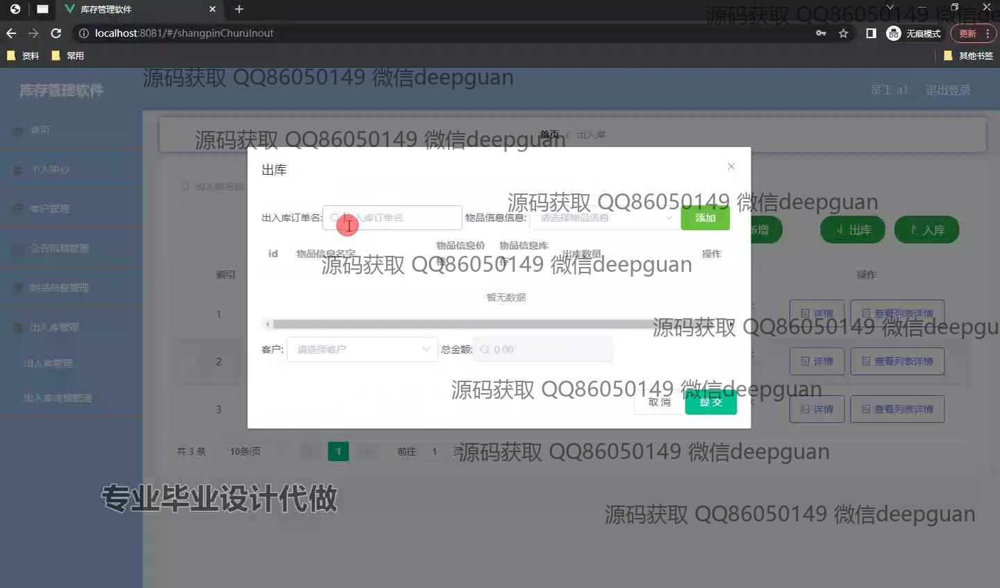
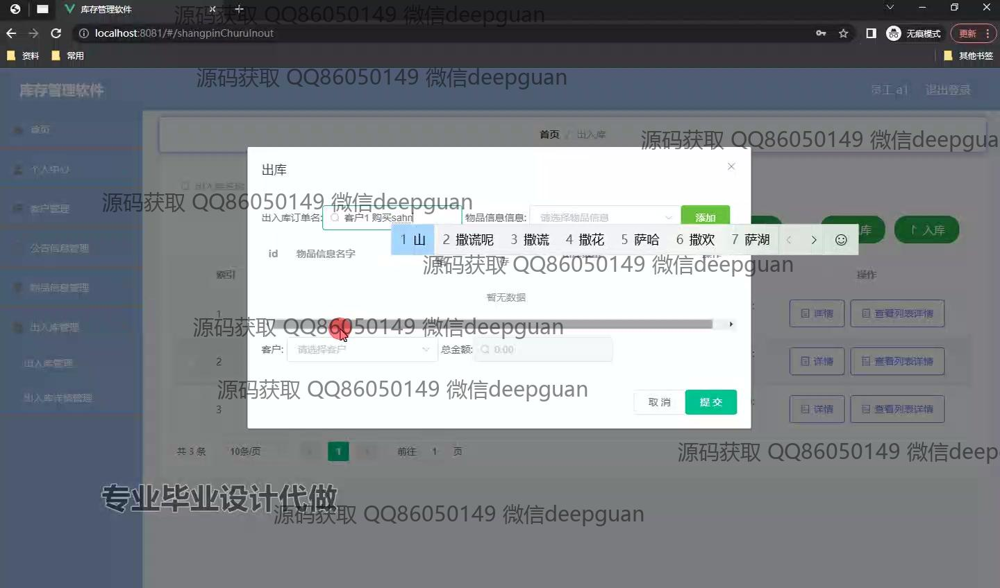
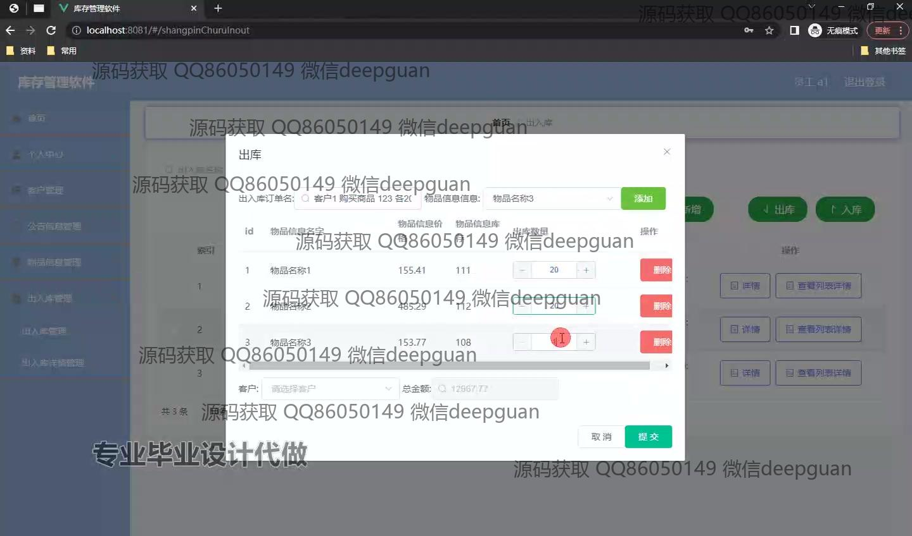
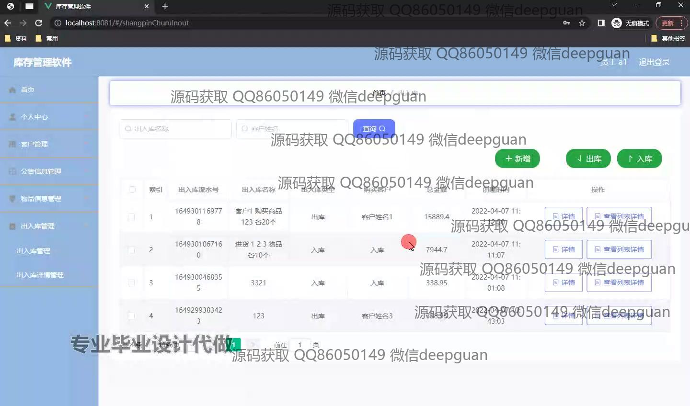
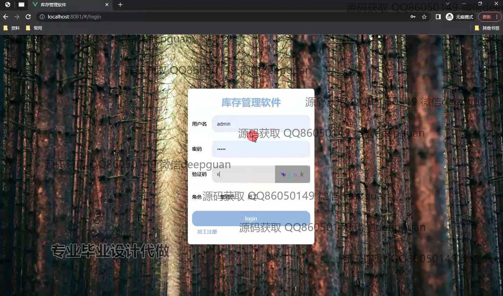
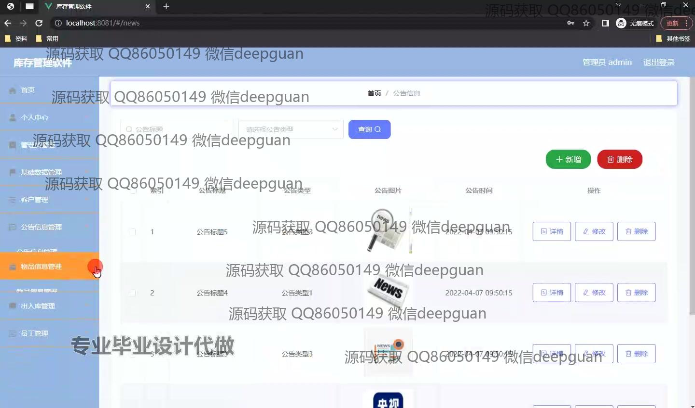
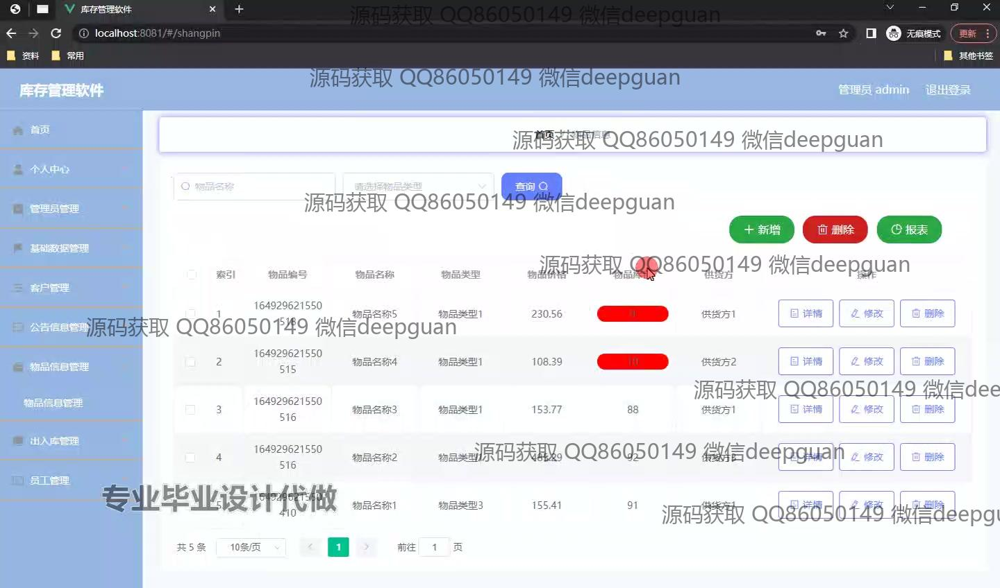
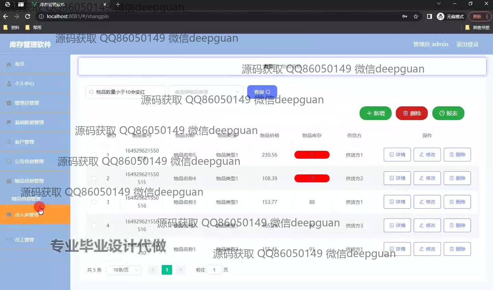

本代码来源于网络,仅供学习参考使用!

